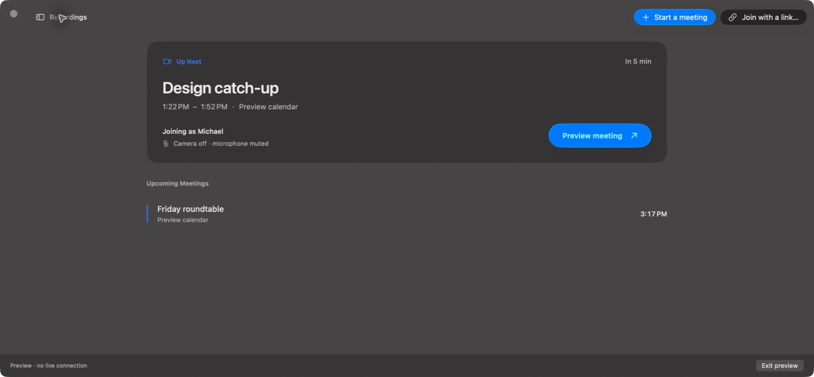
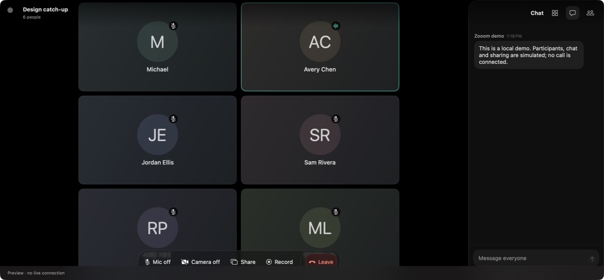

<p align="center">
  
</p>

<h1 align="center">Zooom</h1>

<p align="center"><strong>A calmer home for your Zoom meetings.</strong></p>
<p align="center">Native macOS meetings, a simple agenda, and recordings you can actually find your way through.</p>

<p align="center">
  <a href="#try-zooom">Try the preview</a> ·
  <a href="Documentation/Distribution.md">Release roadmap</a> ·
  <a href="https://github.com/grinich/zooom/issues/new/choose">Report a bug</a>
</p>



Zooom brings your next meeting and your past conversations into one small Mac app. Join from your calendar, keep the conversation in focus, then come back to a recording with its chat and spoken transcript alongside it.

Built with **SwiftUI, AppKit, and the Zoom Meeting SDK**. Requires **macOS 26 or newer and Apple silicon**.

> **Developer preview.** The source is public; the first broadly distributable installer is still being prepared. Account setup currently requires developer configuration. Zooom is an independent project, not affiliated with or endorsed by Zoom.

## Pick up where the meeting left off

Your Zoom cloud recordings have a home of their own.

- **Find a meeting by title or date.** Search naturally with dates such as `Aug 31`, `8/31`, or `last Monday`, and load earlier months when you need them.
- **Stream or save.** Start watching in the app, download a copy to your Mac, or copy the recording’s share link.
- **Switch perspectives without losing your place.** Move between the video layouts supplied by Zoom while keeping your timestamp and playback speed.
- **Read along.** Switch between **Chat** and **Transcript** in the right pane. Messages and spoken passages follow playback and highlight as they happen.
- **Go straight to the useful part.** Search the open recording’s transcript, jump between matches, or click a passage to seek. Copy a passage or export the whole transcript as TXT or WebVTT.
- **Give a recording its own window.** Double-click it in the library, or go fullscreen. Playback runs from **1× to 2.75×**.

Chat, transcripts, and video layouts appear when Zoom includes those files in the cloud recording. [Recording details](Documentation/Recordings.md).

## Less between you and your next meeting

Connect Google Calendar, choose the calendars you care about, and see upcoming Zoom meetings at a glance. Join the next one from the app or menu bar, paste a meeting link, or start a meeting with your own Zoom account. An optional setting lets Zooom handle Zoom’s native meeting links.

## A meeting window that feels like a Mac app



Keep people in a gallery or focus on one person. Open chat and the participant list from the side, share a window or display, and keep the meeting nearby with floating sharing controls. Camera, microphone, recording, and leaving the call stay within reach. Native glass, resizable windows, and keyboard shortcuts keep the interface familiar.

*Screenshots show the native interface with sample meetings and participants. No private meeting content is included.*

## A few keys worth knowing

| While watching a recording | Shortcut |
| --- | --- |
| Play / pause | Space |
| Skip backward / forward | ← / → |
| Cycle playback speed | S |
| Cycle video layout | V |
| Toggle fullscreen | F |
| Show / hide recordings | ⇧⌘R |

Playback shortcuts stay out of the way while you type in a search field.

## Try Zooom

The current preview is for developers and early testing. A public source repository does not grant Zoom account access or replace Zoom’s distribution review. [What is ready, and what is still needed](Documentation/Distribution.md).

To explore the interface with sample data, install **Xcode 26.6 / Swift 6.3.3 or newer**, then:

```sh
git clone https://github.com/grinich/zooom.git
cd zooom
WHOOSH_ZOOM_SDK_PATH=/nonexistent swift run Whoosh --preview
```

For real meetings, download the supported macOS Meeting SDK from Zoom and follow [Zoom setup](Documentation/Zoom-Setup.md). Google Calendar is optional and has its own [connection setup](Documentation/GoogleCalendar.md). Do not distribute a shared SDK client secret in the app.

To build a signed `.app`, see [personal signing and installation](Documentation/Personal-Signing.md). For notarized installers and automatic updates, see [release packaging](Documentation/Releases.md). Internal Swift module and executable names remain `Whoosh`.

Run the SDK-free test suite:

```sh
WHOOSH_ZOOM_SDK_PATH=/nonexistent bash Scripts/test.sh --scratch-path /tmp/zooom-tests
```

## Support and feedback

Use **Help → Report a Bug** in the app, or [open a GitHub issue](https://github.com/grinich/zooom/issues/new/choose). Include the app version, macOS version, what happened, and how to reproduce it. Please remove meeting links, passcodes, credentials, and private messages from screenshots or logs before posting.

Questions and feature requests are welcome in [Issues](https://github.com/grinich/zooom/issues). For the project’s data handling, see [Privacy](PRIVACY.md). Third-party components retain their own licenses; see [Third-party notices](THIRD_PARTY_NOTICES.md).
